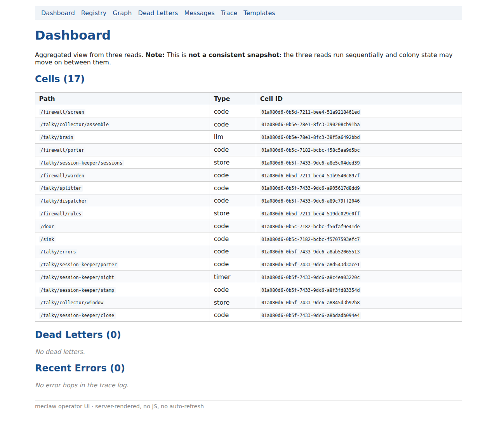

<div align="center">

# meclaw

_Where agents build agents._

<p align="center">
  <a href="https://github.com/mmeyerlein/meclaw/actions/workflows/ci.yml"></a>
  <a href="https://github.com/mmeyerlein/meclaw/releases"></a>
  <a href="#license"></a>
</p>

</div>

One Linux binary that runs a tree of agents. Every folder in the tree is a cell: one actor, one
`config.json`, one SQLite file, one kernel sandbox (Landlock, network namespace, cgroup v2,
seccomp). Edges between folders are the routes a message may take. The binary ships no agent loop;
a loop is an edge that routes back into an `llm` cell. To change a running system you POST a diff
to one endpoint: validated, applied without a restart, written to a ledger. Agents change the
system through the same endpoint. **meclaw-os** and an **assistant** are grown onto that tree at
runtime from JSON, not deployed.

I built meclaw because I wanted to build agents with agents, and every tool I tried was either a
pile of Python or a cage; nineteen versions later, this is what was left.

Forty templates ship as JSON declarations and Python scripts, and `templates/` holds no Rust at
all. Out of them you grow an assistant with sessions of its own, a memory that outlives the context
window, a display with its own origin and a phone line, into a running colony, without stopping
it. A colony is what one running tree of cells is called here.



## Get started

Four steps, and the colony in the picture is answering you: install the binary, start an empty
colony, grow the OS into it while it runs, ask it something.

```bash
# 1 — install meclaw: one static Linux binary (lands in ~/.local/bin)
curl -fsSL https://meclaw.ai/install.sh | sh
export PATH="$HOME/.local/bin:$PATH"

# 2 — start an empty colony
# the templates must match the binary: clone the tag the installer just gave you
git clone --depth 1 --branch "v$(meclaw --version | cut -d' ' -f2)" \
    https://github.com/mmeyerlein/meclaw && cd meclaw
# one key — replace sk-... with a real one (https://openrouter.ai/keys), or step 4 ends in code=auth
printf 'OPENROUTER_API_KEY=sk-...\nMODEL_BRAIN=openai/gpt-5.6-luna\n' > examples/meclaw-os/seed/.env
# 7777 is an arbitrary free port: if it is taken, change it in every line below as well.
# The very first start reads a 25 MB binary from cold disk and can stay silent for ~40 s; every later start takes well under a second.
meclaw --root examples/meclaw-os/seed --templates ./templates --daemon --api 127.0.0.1:7777

# 3 — grow the OS into the running colony: one POST, nothing restarts
curl -s -X POST 127.0.0.1:7777/colony/mutations \
     -H 'Content-Type: application/json' -d @examples/meclaw-os/grow.json

# 4 — talk to your assistant
meclaw ask --api 127.0.0.1:7777 --target /door "Say hello in one short sentence."
```

`--daemon` runs in the foreground and stops on Ctrl-C, so step 2 keeps its terminal. Run steps 3
and 4 in a second shell. The browser view is at `http://127.0.0.1:7777/ui/` while the daemon runs.

## What just happened

Step 1 put one binary on your machine and nothing else. No runtime to install beside it, and no
database to point it at.

Step 2 booted a colony out of a seed of two files, with no cell in it but the empty root hive.
Step 3 grew seventeen cells into that colony while it ran, from one JSON file naming four
templates and four edges, and nothing restarted. `POST /colony/mutations` is also the endpoint
an agent goes through when it wants to change the tree, which is the whole of what "grown at
runtime" means here.

Step 4 posted a turn to `/door` and read the answer back. The answer is a hop on the colony's
own record, so `meclaw ask` reads it out of `GET /colony/trace`, where every other hop of that
turn is waiting too. The page in the picture is that same record with a nav bar on it.

## Why it is built this way

- meclaw ships no agent loop, because a loop is an edge that routes an answer back into the cell that asked ([the store-backed tool loop](docs/store-backed-tool-loop.md)).
- The harness lives in the filesystem, so `ls`, `grep`, `diff` and `git` are the tooling and every change to a topology is a diff ([everything is a file](docs/why/everything-is-a-file.md)).
- meclaw-os ships the organisation, its people, their assistants and their channels as templates under one rule: a level owns what its siblings must share ([an operating system for agents](docs/why/an-os-for-agents.md)).
- The shipped assistant runs two models, a conversation surface that answers fast and a reasoning core that thinks ([one assistant, two brains](docs/why/two-brains.md)).
- A conversation can run for weeks because the window was never where the conversation was stored ([memory that outlives the window](docs/why/memory.md)).
- The builder drafts against a typed catalogue, the template library and its declarations, and `add_templates` teaches a running colony a class it did not have ([ontology](docs/why/ontology.md)).
- The primitives for self-improvement are here and tested, and no loop closes them unattended ([prepared for self-improvement](docs/why/rsi.md)).
- You talk to the assistant and it shows you, on a display that belongs to you and not to one of the agents ([you talk, it shows](docs/why/you-talk-it-shows.md)).
- The security model is the kernel itself, which is what one static Linux binary buys and what a macOS build could not ([why Rust, why Linux only](docs/why/rust-and-linux.md)).
- argus, affinity, talky and cogny are role names, and each one carries its reason in a line ([names of the shipped roles](docs/glossary.md#names-of-the-shipped-roles)).

## Where it sits among other systems

| System | What meclaw shares | What meclaw does differently |
|---|---|---|
| Erlang/OTP | actors, mailbox, supervisor | the topology is a file rather than code; specialised for LLM work |
| LangGraph | a graph for LLM agent flows | language-agnostic, file-based, persistent |
| Temporal | durable execution, message log | lightweight, decentralised, a filesystem DSL |

The [system overview](docs/meclaw-overview.md) carries the same table with three more rows: NATS,
Node-RED, and BPMN with Serverless Workflow.

## Quick links

- [Read the whole system once](docs/meclaw-overview.md): cells, edges, headers, routing, mutations and the lifecycle, in the one document that wins on conflict.
- [Glossary](docs/glossary.md): the sixteen words the other documents assume.
- [Find out what each cell type does](docs/cell-types.md)
- [Write a `config.json` by hand](docs/config.md)
- [Change a colony while it runs](docs/rewiring.md): the procedure, and the traps that catch everyone once.
- [Know what is under contract and what is not](docs/stability.md)
- [Pick a template to start from](templates/README.md): forty of them, each with a README of its own.
- [Watch a colony refuse an attack](examples/hard-shell/WALKTHROUGH.md): every command in it was recorded from a real terminal.
- [Measure what a colony costs to run](docs/costs.md)
- [Find the document that answers your question](docs/README.md): one line per document, and what you can do once you have read it.
- [Read a whole colony end to end](examples/README.md): from a two-cell one to a four-level stack grown from an empty seed.
- [Send a patch](CONTRIBUTING.md), [see what is planned](ROADMAP.md), [read what changed in each release](CHANGELOG.md)

## Where it stands

Linux x86_64 only. The release is a static musl build, and the installer refuses any other platform.
A `code` cell runs `python3` and no other runner. The daemon installs no authentication and no
TLS; put a reverse proxy in front of it, like any Linux daemon. HTTP and files are the whole
interface, and there is no SDK to import. meclaw is under heavy development, and I would not
leave it unattended in production. The 0.33.0 release gate ran 6953 tests. One measured colony
spent 0.32 EUR on a day of conversation ([docs/costs.md](docs/costs.md)).

## Stability

Five surfaces are the public contract of this project: the HTTP API, the template DSL, the template
ports, the `web` cell's own origin, and the documented `error_code` strings. On `0.x` those five
change additively, and a change that breaks an existing topology gets its own Breaking section in
[CHANGELOG.md](CHANGELOG.md); what each surface covers is written out in
[stability](docs/stability.md).

## License

MIT ([LICENSE-MIT](LICENSE-MIT)) or Apache 2.0 ([LICENSE-APACHE](LICENSE-APACHE)), whichever you
like.
